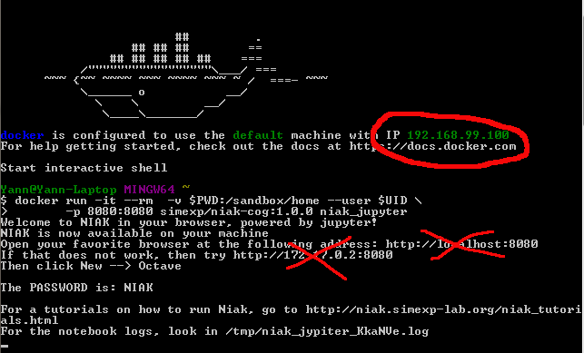
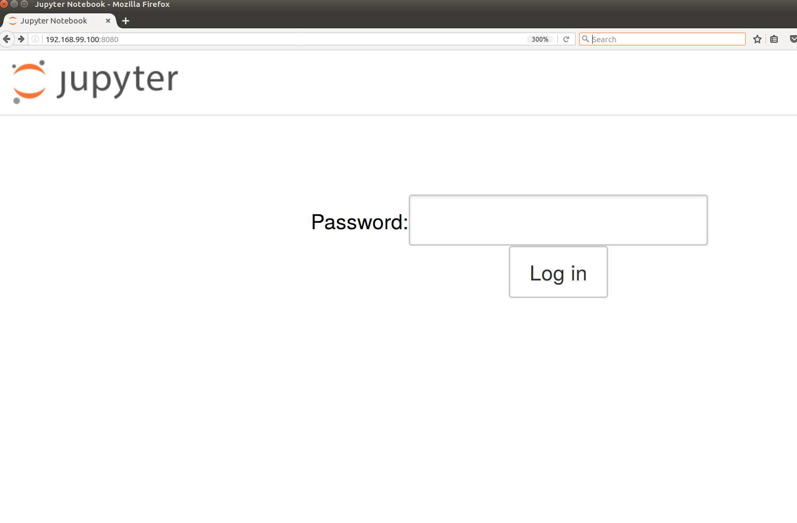

# Installation

The recommended way to install NIAK is to use a [docker](https://www.docker.com/) container, which bundles the NIAK library with all of its dependencies. Docker acts as a lightweight virtual machine, and improves the repeatability of results across operating systems, including Linux, Windows or Mac OSX. Using NIAK through docker also makes it very easy to update the software. To run niak with docker on your work station, you will need super user or sudo privilege. Start by installing docker, following the official [docker installation site](https://docs.docker.com/installation/). **Disclaimer**: Be aware that any user that can execute a "docker run"  command on a machine have access to the complete file system as a super user. Alternatively, you can use [singularity](http://singularity.lbl.gov/) which will be able to play the same docker image, while keeping tight control on user rights. Instructions for singularity can be found in the section on [installation for high-performance computing](http://niak.simexp-lab.org/niak_HPC_installation.html).

 > [](https://www.docker.com/)

 ## General configuration

 NIAK is using a pipeline system called [PSOM](http://psom.simexp-lab.org), a free open-source software (MIT license). With PSOM, it is possible to run computations in parallel on a laptop or a supercomputer, restart efficiently analysis or access detailed logs. In all pipelines, the options of psom are set using the field `opt.psom`. The most important parameter is the maximal number of processes that PSOM can run in parallel. More details about PSOM capabilities and configuration can be found in the dedicated [tutorial](http://psom.simexp-lab.org/psom_configuration.html).
 ```matlab
 % Use up to four processes
 opt.psom.max_queued = 4;
 ```


## Linux
### installing docker
After the docker installation, the first step is to create a docker group and add the user that will use docker to that list.
```bash
# Some distro create the group during installation,
#   if it is that case, the command will return an error, just ignore it
sudo groupadd docker
# Then add user USERNAME to the docker group
sudo usermod -a -G docker $USERNAME
# Activate the new group
newgrp docker
```
All the members of the docker group will have access to the docker service. For the docker group to become effective, you may need to either logout and login or restart your system.

### Running NIAK in a Jupyter Notebook

NIAK in a Jupyter Notebook is the preferred method to run NIAK. Type the following command in a terminal:

```bash
docker run -it --rm  -v $PWD:/sandbox/home --user $UID \
       -p 8080:8080 simexp/niak-cog:latest niak_jupyter
```

the output should looks like the following:
```
Welcome to NIAK in your browser, powered by jupyter!
NIAK is now available on your machine
Open your favorite browser at the following address: http://localhost:8080
If that does not work, then try http://172.17.0.2:8080
Then click New --> Octave

The PASSWORD is: NIAK

For a tutorials on how to run Niak, go to http://niak.simexp-lab.org/niak_tutorials.html
For the notebook logs, look in /tmp/niak_jypiter_Ln3BTm.log
```
You can now start your favorite browser and go to [http://localhost:8080](http://localhost:8080). Once the page is open, Jupyter will request a password, use NIAK. Then click New --> Octave. You now have access to all NIAK features! Note that the NIAK outputs will be in the directory where the `docker run` command has been executed.

You should then have access to the file present in the directory where `niak_jupyter` was started.

### Running NIAK in a terminal

The following command will start NIAK with your home directory accessible (the rest of the file system is not accessible):
```bash
xhost +local:
docker run -i -t --privileged --rm \
       --name niak \
       -v $HOME:$HOME -v /etc/group:/etc/group \
       -v /etc/passwd:/etc/passwd -v /etc/shadow:/etc/shadow  \
       -v /tmp:/tmp \
       -e DISPLAY=unix$DISPLAY \
       --user $UID \
       simexp/niak-cog:latest \
       /bin/bash -ic "cd $HOME; octave --force-gui; /bin/bash"
```

Replace `simexp/niak-cog:latest` by, for example, `simexp/niak-cog:1.0.1` to use a specific version (here 1.0.1). Note that the first execution will be longer, since the `simexp/niak-cog` image has to be downloaded from the internet. All subsequent call to the line will start niak immediately, and will be much faster. Close the GUI and type "exit" in the terminal to stop your session. if somehow the process did not exit properly and docker complains that niak is already running when you restart it, type:
```bash
docker stop niak
docker rm niak
```

The procedure as been tested on Debian 8.0, Ubuntu `>=` 14.10, centOS 7, fedora `>=` 20, OpenSuse `>=` 13.1 and we expect it to run smoothly on most Linux distributions.

## Mac OSX
### Installing docker
On more recent OSX distribution (>= 10.10.3, or better > 10.11), Docker usage is straightforward. Downoload the stable channel from the [docker mac install page](https://docs.docker.com/docker-for-mac/install/#download-docker-for-mac). Docker for mac also requires MMU enable hardware. You should be safe if your laptop was build in 2010 or later.

For older distributions/hardware, you can still install Docker, the task is not always as smooth, but is [explained in detail here](https://docs.docker.com/toolbox/toolbox_install_mac/).

### Running NIAK in a Jupyter Notebook
We recommend using a Jupyter notebook to run NIAK on OSX for a full featured user interface experience of NIAK. Type the following command in a terminal:

```bash
bash # Force the use of BASH, you can skip this line if already using BASH
docker run -it --rm  -v /tmp:/tmp -v $PWD:/sandbox/home --user $UID \
       -p 8080:8080 simexp/niak-cog:latest niak_jupyter
```

the output should looks like the following:
```
Welcome to NIAK in your browser, powered by jupyter!
NIAK is now available on your machine
Open your favorite browser at the following address: http://localhost:8080
If that does not work, then try http://172.17.0.2:8080
Then click New --> Octave

The PASSWORD is: NIAK

For a tutorials on how to run Niak, go to http://niak.simexp-lab.org/niak_tutorials.html
For the notebook logs, look in /tmp/niak_jypiter_Ln3BTm.log
```
You can now start your favorite browser and go to [http://localhost:8080](http://localhost:8080). Once the page is open, Jupyter will request a password, use NIAK. Then click New --> Octave. You now have access to all NIAK features! Note that the NIAK outputs will be in the directory where the `docker run` command has been executed.

You should then have access to the file present in the directory where `niak_jupyter` was started.

### Running NIAK in a terminal
You can also run the following command in your favorite terminal to get an `octave` session with NIAK included.


```bash
bash
docker run -it --privileged --rm  -v /tmp:/tmp -v $HOME:$HOME \
       simexp/niak-cog:latest \
       /bin/bash -ic "cd $HOME; octave; /bin/bash"
```

Note that Macs often have tcsh terminal by default, the first line with `bash` forces your terminal to be in bash mode.

Note that one could access the octave gui by installing xquart on its mac, we do not officially support this feature but you can have a look [here](https://fredrikaverpil.github.io/2016/07/31/docker-for-mac-and-gui-applications/) for a procedure.

## Windows
### Installing Docker
If you have a Windows 10 Pro, the [docker installation](https://docs.docker.com/docker-for-windows/install/) is straight forward. Note that, as mention in the instruction, [virtualization must be enabled](https://docs.docker.com/docker-for-windows/troubleshoot/#virtualization-must-be-enabled)

For older distributions, the task is not always as smooth, but is [explained in detail here](https://docs.docker.com/toolbox/toolbox_install_windows/).

### Running NIAK in a Jupyter Notebook

We recommend using a Jupyter notebook to run NIAK on windows for a full featured user interface experience of NIAK (see bellow), but you can also run the following command in your favorite terminal to get an `octave` session with NIAK included.

From the docker web site: _"If you are using Windows containers, keep in mind that there are some limitations with regard to networking [...] One thing you may encounter rather immediately is that published ports on Windows containers do not do loopback to the local host. Instead, container endpoints are only reachable from the host using the container’s IP and port."_

Hence, once you start Docker and spin off NIAK with the following command
```bash
docker run -it --rm  -v $PWD:"/sandbox/home"  --user nobody  -p 8080:8080 \
 simexp/niak-cog:latest niak_jupyter
```
> []

You will need to open your browser with the address provided to you by the docker virtual machine. The adress `192.168.99.100` is circled in red in the example above. You then open your favorite browser to the address appended by port `8080`: `192.168.99.100:8080`. Once the page is open, Jupyter will request a password, use NIAK.

> []

Then click New --> Octave. You now have access to all NIAK features! Note that the NIAK outputs will be in the directory where the `docker run` command has been executed.


### Running NIAK in a terminal
You can also run the following command in your favorite terminal to get an `octave` session with NIAK included.

```bash
docker run -it --privileged --rm \
       simexp/niak-cog:latest \
       /bin/bash -ic "cd $HOME; octave; /bin/bash"
```

## High performance computing
The most straight forward way of installing NIAK on an HPC (High Performance Computer) system is trough its [Singularity]( http://singularity.lbl.gov/) image. [Singularity]( http://singularity.lbl.gov/) is a Linux container system "designed around the notion of extreme mobility of compute and reproducible science".
This installation procedure can also be used on a simple desktop or laptop but we still recommend the [Docker installation](http://niak.simexp-lab.org/niak_installation.html) in this case.

First you need to ask your system administrator to install [Singularity](http://singularity.lbl.gov/) on the system. We recommend [release](http://singularity.lbl.gov/all-release) 2.2 or higher.

The administrator decides in the installation which part of the HPC file system will be accessible to users in the Singularity containers, make sure that the partition where your data lives is include in the "bind path".

Once Singularity is installed, running NIAK is straight forward. Download NIAK by clicking in niak_singularity.tgz in the latest [release from the NIAK github page](https://github.com/SIMEXP/niak/releases/latest). Decompress the tar ball on your computer:

```
tar -zxvf niak_singularity.tgz
```
you can test the installation right away by typing:

```
cd niak_singularity
./psom_console.sh niak-VERSION-NAME-AND-NUMBER.img
```
Depending on the local file system setup, it can take a couple of seconds to load  NIAK the first time. Wait a bit, you should now be in an octave console with a fully functional NIAK installation.
You are now ready to run our [tutorials](http://niak.simexp-lab.org/niak_tutorials.html) on the local host.

### Basic HPC Configuration
By default the installation runs only on the host where it was installed and with only one core. To change that, open the `psom_gb_vars_local.m` with your favorite editor change `gb_psom_mode` from `session` to `singularity` mode:
```octave
%gb_psom_mode = 'session';
%gb_psom_mode = 'background';
gb_psom_mode = 'singularity';
```
Right now the `singularity` mode only works with system using the `qsub` command. Any options needed by your local HPC to run the qsub command can be added to `gb_psom_qsub_options`. For example, on compute Canada Guillmin HPC, ones need to state his group id in every qsub call. This requirement is met by adding the following in `psom_gb_vars_local.m`
```octave
gb_psom_qsub_options = '-A my-guillimin-group-id';.
```

With this minimal configuration, you should be able to use the full power of your HPC!

Note that you can also test the installation on multiple core, on the local host by changing `psom_gb_vars_local.m` to
```octave
%gb_psom_mode = 'session';
gb_psom_mode = 'background';
%gb_psom_mode = 'singularity';.
```

This would be the recommended mode for desktop/laptop install.

### More configurations
The tar ball comes with a `psom.conf` file. This configuration can be stored in three places. In `/etc/psom.conf`, along with the `psom_console.sh` file (that is how it is shipped in the tar ball) or here: `${HOME}/.config/psom/psom.conf`. Note that the file are loaded in that order. So a user can overwrite the system `/etc/psom.conf` in `${HOME}/.config/psom/psom.conf`. If you do not have root access to the system, a `psom.conf` file living in the `psom_console.sh` directory can act as a system wide config.

The configuration tells "psom_console.sh" where to look for the `psom_gb_vars_local.m` file and the `niak-VERSION-NAME-AND-NUMBER.img` images. The default is to find them at the same location than `psom_console.sh` itself. You also need to set the `PSOM_SINGULARITY_OPTIONS` variable so that directory other than the host `${HOME}` and `/tmp` are accessible to the NIAK software. For example, if you need to mount the `/scratch` directory, you can uncomment the line:
```
PSOM_SINGULARITY_OPTIONS='-B /scratch'.
```  

Note that `PSOM_SINGULARITY_IMAGES_PATH` works in the same way as $PATH does. One can add valid NIAK images in many directories like this:
```
PSOM_SINGULARITY_IMAGES_PATH=/usr/local/niak_singularity_images/:$HOME/my_niak_images
```
 then,
```
om_console.sh -l
```
will list all the images stored in these directories. Note that all images should preferably have different names.

### Adding new images on the system

Many NIAK versions can be accessible at the same time on a HPC system. Once psom_console has been installed. Just download and decompress any on the `niak-*.img.tgz` tar ball found in the [release section of the NIAK github page](https://github.com/SIMEXP/niak/releases) in a path included in `PSOM_SINGULARITY_IMAGES_PATH`. It is now accessible in `psom_console`.
